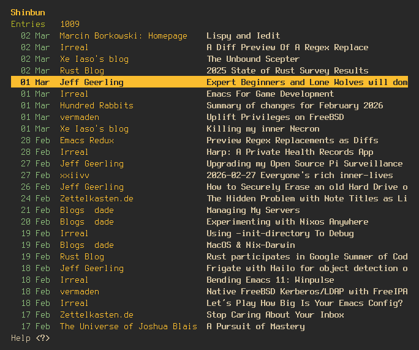

#+title: shinbun
#+author: Moskas
#+options: \n:t

shinbun (新聞) is a terminal-based RSS/Atom feed reader written in Rust, using ratatui and crossterm. It draws some inspiration from newsboat.

* Features

- RSS and Atom feed support
- Local SQLite cache for offline reading and persistent read state
- Tag-based feed organization with a dedicated tags pane
- Query feeds that aggregate entries across multiple feeds by tag
- Read/unread tracking with per-entry and per-feed bulk marking
- Hide/show read entries
- Fuzzy search across feeds and entries
- Configurable color theme via =config.toml=
- Article link extraction popup
- Open entries in a configurable browser or media player
- Vim-style keybindings

* Installation

Requires Rust (stable). Clone the repository and build with cargo:

#+begin_src shell
cargo build --release
#+end_src

The binary will be at =target/release/shinbun=.

* Configuration

Configuration files are stored in the platform config directory under =shinbun/=.

** Linux / macOS
#+begin_src
~/.config/shinbun/
#+end_src

** Windows
#+begin_src
%APPDATA%\shinbun\
#+end_src

Two files are used:
- =feeds.toml= (required) -- defines the feeds to subscribe to
- =config.toml= (optional) -- UI settings, general options, query feeds, and theme

** feeds.toml

Each feed is declared as a =[[feeds]]= entry. The =link= field is required. =name= and =tags= are optional.

#+begin_src toml
[[feeds]]
link = "https://example.com/feed.xml"

[[feeds]]
link = "https://blog.example.org/rss"
name = "Example Blog"
tags = ["tech", "blog"]
#+end_src

If =name= is set, it overrides the title provided by the feed itself.

** config.toml

#+begin_src toml
[general]
browser = "firefox"           # optional, defaults to system default
media_player = "mpv"          # optional, defaults to system default

[ui]
show_borders = true           # default: true
show_read_entries = true      # default: true
show_scrollbar = true         # default: true

[[queries]]
name = "Tech"
query = "tags:tech"

[[queries]]
name = "All"
query = "*"
#+end_src

Query feeds aggregate entries from all feeds whose tags match the query. Use =tags:tag1,tag2= to match specific tags, or =*= to match everything.

** Theme

All colors in the UI can be customized under the =[ui.theme]= key. Every field is optional; omitted values fall back to built-in defaults so the app looks identical without any theme configuration.

Color values support:
- Named colors: =red=, =blue=, =dark_gray=, =light_cyan=, etc.
- Hex RGB: =#rrggbb= (e.g. =#cb4b16=)
- RGB tuple: =rgb(r,g,b)= (e.g. =rgb(203,75,22)=)
- ANSI 256 index: =0= -- =255=

#+begin_src toml
[ui.theme]
# Chrome
border = "blue"
title = "yellow"

# Feed / entry list
count = "blue"
read = "dark_gray"
header = "white"              # optional, bold-only when unset
highlight_bg = "dark_gray"
highlight_fg = "yellow"

# Entry list columns
date = "cyan"
source = "yellow"

# Search bar
search_prompt = "yellow"
search_cursor = "gray"
search_info = "dark_gray"
search_no_match = "red"
search_match_read = "gray"
search_dim = "dark_gray"

# Entry view metadata
meta_title = "magenta"
meta_feed = "cyan"
meta_published = "yellow"
meta_link = "blue"
line_info = "yellow"
entry_title_bordered = "yellow"
entry_title_plain = "green"

# Markdown rendering
h1 = "cyan"
h2 = "magenta"
h3 = "blue"
h4 = "red"
h5 = "light_cyan"
code = "yellow"               # optional, bold-only when unset
link = "blue"
metadata_block = "light_yellow"

# Popups
error_border = "red"
error_title = "yellow"
loading_border = "cyan"
loading_done_border = "green"
confirm = "yellow"
confirm_message = "white"

# Help popup
help_section = "cyan"
help_key = "yellow"
help_border = "blue"

# Links popup
link_index = "yellow"
link_url = "blue"
links_border = "blue"
#+end_src

A complete example Solarized Dark theme is available in [[./examples/solarized_dark.toml]].

* Keybindings

| Key                           | Action                     |
|-------------------------------+----------------------------|
| =j= / =Down=                  | Move down                  |
| =k= / =Up=                    | Move up                    |
| =l= / =Enter= / =Right=       | Open / Enter               |
| =h= / =Backspace= / =Left=    | Go back                    |
| =g g= / =Home=                | Go to top                  |
| =G= / =End=                   | Go to bottom               |
| =/=                           | Fuzzy search               |
| =Tab= / =Ctrl+n=              | Next search match          |
| =Shift+Tab= / =Ctrl+p=        | Previous search match      |
| =t=                           | Toggle feeds / tags pane   |
| =r=                           | Refresh selected feed      |
| =R=                           | Refresh all feeds          |
| =m=                           | Toggle read / unread       |
| =A=                           | Mark feed as read          |
| =u=                           | Toggle hide read entries   |
| =o=                           | Open entry in browser      |
| =L=                           | Show article links         |
| =p=                           | Play media attachment      |
| =e=                           | Show feed errors           |
| =?=                           | Toggle help                |
| =q=                           | Quit                       |

Press =?= inside the application to see the full keybinding reference.

* Data Storage

Feed data and read state are cached in a SQLite database at =shinbun/cache.db= inside the config directory. Entries that age out of a feed's remote source are preserved locally so history and read state are not lost. Feeds removed from =feeds.toml= are pruned from the cache on the next launch.
